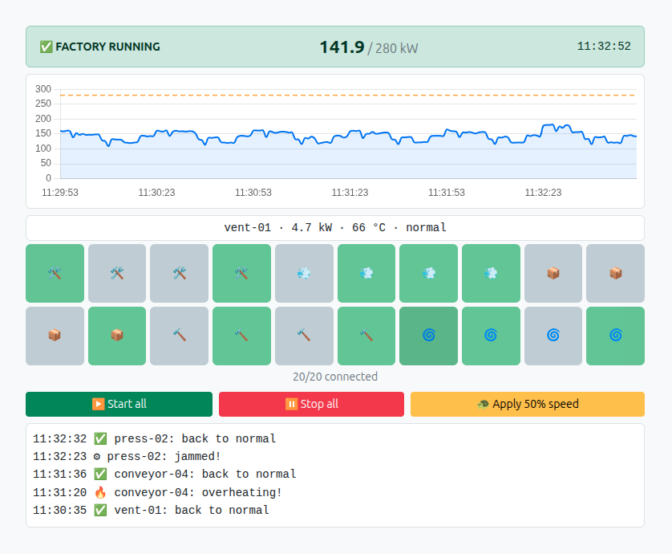

# MQTT hardware control on .NET

- 20 simulated factory devices publish their live readings over **MQTT**.
- On tile click, a command goes through MQTT and the machine stops.



## MQTT in 60 seconds

- **MQTT is not a queue — it's a broker.** Nobody talks to anybody directly. There is a middleman. Everyone connects to it, some **publish** messages, others **subscribe** — and the broker instantly hands each message to whoever is subscribed.
- A **topic** is just a named channel like `health/press-01`, and a *subscription* is saying "give me everything published to this topic" — with wildcards like `health/+`.
- **Mosquitto** is the broker we use — a tiny MQTT server. It runs as a stock Docker image (`eclipse-mosquitto:2`) and is configured by [`mosquitto/mosquitto.conf`](mosquitto/mosquitto.conf): listen on TCP `1883`, allow
  anonymous clients, keep retained messages, log to `stdout`. 

## Project tour

```
Shared/   the "wire language" both sides speak
Hw/       the simulated hardware (20 MQTT clients)
Ui/       the control panel (ASP.NET Core + SignalR web page)
```

### `Hw/HwItem.cs` — the "physics" of one device

A pure C# class with **no networking at all** — just behavior:

- **`Work` — the tick.** Computes power draw and temperature, returns a snapshot. May produce a fault.
- **`Obey` — accepting a command.** Start, stop or speed. The command simply mutates with each *next tick* .
- **Faults** are part of the fun: overheat, jam, and short circuit — which takes the device offline for a while.

### `Hw/HwMqttChip.cs` — the simulated "MQTT chip"

If `HwItem` is the motor, `HwMqttChip` is the network board. One chip = **one real TCP connection** to the broker.

- connects with retry (the broker container may start later)
- subscribes to **its own** `command/{id}` topic
- once per second calls `Work()` and publishes to `health/{id}`
- hands every incoming command to `Obey()`
- announces `isonline/{id}` — but **only when the state changes**

Two MQTT features worth knowing here:

- **Retained messages** (`retain` flag): the broker keeps the *last* message for new subscribers.

- **LWT (Last Will):** publish `isonline: false` on my behalf, if I disappear and won't be able to.

The chips also use two QoS levels: QoS 0 ("fire and forget"), and QoS 1 for commands.

### `Hw/HwFleetWorker.cs` — runs hardware fleet

A `BackgroundService` hosted in a console app. On startup it:

- reads its settings from environment variables (`MQTT_HOST`, `HW_COUNT`, `FAULT_PROBABILITY`…)
- asks `HwFleetFactory` to build N devices with realistic names (`press-01`, `conveyor-02`, …)
- wraps each device in its own `HwMqttChip` and starts all of their `RunAsync` loops **concurrently** 
- then `await Task.WhenAll(...)` — which keeps the service alive until shutdown

## Running it

Everything lives in one file — [`docker-compose.yml`](docker-compose.yml) — three
services on a shared network:

| Service | What it is | Configured by |
|---|---|---|
| `broker` | stock `eclipse-mosquitto:2` image, port `1883` | [`mosquitto/mosquitto.conf`](mosquitto/mosquitto.conf), mounted read-only |
| `ui` | control panel, [`Ui/Dockerfile`](Ui/Dockerfile), port `8080` | `MQTT_HOST`, `MQTT_PORT`, `POWER_LIMIT_KW` |
| `hw` | device fleet, [`Hw/Dockerfile`](Hw/Dockerfile) | `MQTT_HOST`, `MQTT_PORT`, `HW_COUNT` (fleet size), `FAULT_PROBABILITY` (chaos level) |

All app settings come **only** from environment variables with sane defaults — there are no `appsettings`.

### Start everything

```bash
docker compose up --build
# Control panel:  http://localhost:8080
```

That's the whole deployment. Stop it with `docker compose down`.

### Peek at the raw MQTT traffic (recommended!)

```bash
# everything flowing through the broker, live:
docker compose exec broker mosquitto_sub -t '#' -v

# stop a press by hand (what a tile click does):
docker compose exec broker mosquitto_pub -t 'command/press-01' -m '{"command":"STOP"}'
```
